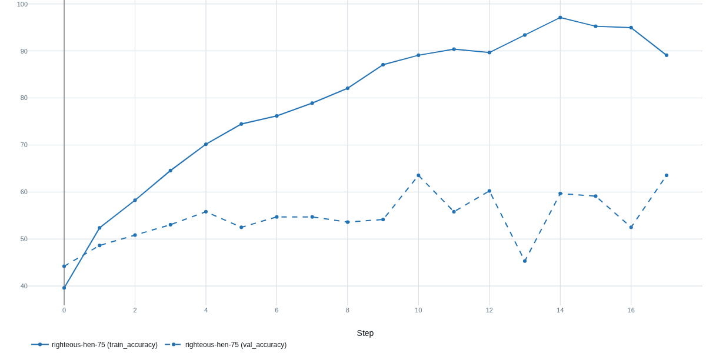
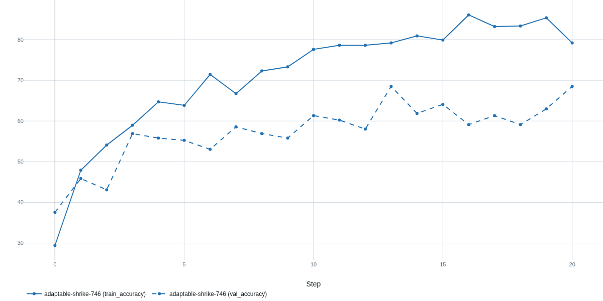
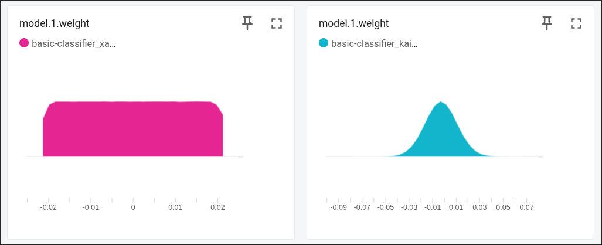

# Preguntas sobre el ejemplo de clasificación de imágenes con PyTorch y MLP

## 1. Dataset y Preprocesamiento
- **¿Por qué es necesario redimensionar las imágenes a un tamaño fijo para una MLP?**
Es necesario porque a la MLP se le entra con un vector de tamaño fijo. Si las entradas tuvieran diferentes tamaños, la capa de entrada no podría tener un número constante de pesos, como lo tiene.

- **¿Qué ventajas ofrece Albumentations frente a otras librerías de transformación como `torchvision.transforms`?**
Albumentations está optimizado en OpenCV, por lo que tenderá a ser más rápido que implementaciones basadas en PIL de torchvision, tiene un amplio repertorio de transformaciones avanzadas que no están en torchvision. 

- **¿Qué hace `A.Normalize()`? ¿Por qué es importante antes de entrenar una red?**
Para entrenar una red es importante eliminar los sesgos que puedan aparecer. Por ejemplo, nos podría importar hacer que todos los canales tengan media cero y varianza unitaria, para que el entrenamiento converja de manera rápida y estable. Esto es lo que hace la función `normalize()` de Albumentations. A cada píxel le resta la media por canal y lo divide por el desvío estándar del canal.

- **¿Por qué convertimos las imágenes a `ToTensorV2()` al final de la pipeline?**
Esta función convierte la imagen, que es un array de numpy de HxWxC en un `torch.FloatTensor` con determinada forma y valores entre 0 y 1. Esto es lo que esperan los modelos de PyTorch a la entrada.

## 2. Arquitectura del Modelo
- **¿Por qué usamos una red MLP en lugar de una CNN aquí? ¿Qué limitaciones tiene?**
La MLP es más sencilla de implementar y es menos costosa en cómputo. Sin embargo, tiene varias limitaciones. Primeramente al hacer un flatten, la MLP aplasta la imagen y vuelve un array, por lo que se pierde información de vecindad entre los pixeles. Una CNN aprovecha convoluciones para detectar patrones espaciales. También, al crecer el tamaño de la imagen, las capas densas aumentan muy rápidamente en número de pesos, encareciendo cómputo y memoria.

- **¿Qué hace la capa `Flatten()` al principio de la red?**
La capa flatten toma cada muestra de la forma HxWxC y la "aplasta" en un vector 1D de tamaño H\*W\*C.

- **¿Qué función de activación se usó? ¿Por qué no usamos `Sigmoid` o `Tanh`?**
Se usa la ReLU. Esta evita el desvanecimiento del gradiente en capas profundas, tiene mayor rango dinámico por no estar acotada en su parte positiva (lo cual puede servir para comparar regiones claras vs oscuras en la foto) y pone a cero las activaciones negativas, lo cual sirve para eliminar el ruido generado por tejido sano. Sigmoid y tanh tienen derivada casi cero en las regiones extremas, por lo que se hace difícil el aprendizaje de detalles finos. Además, estas dos últimas son mas costosas en cómputo que la ReLU.

- **¿Qué parámetro del modelo deberíamos cambiar si aumentamos el tamaño de entrada de la imagen?**
Tendría que cambiar el `input_size` para que `nn.Linear` reciba el número correcto de entradas.

## 3. Entrenamiento y Optimización
- **¿Qué hace `optimizer.zero_grad()`?**
Pone a cero los gradientes almacenados en `param.grad` de todos los parámetros optimizados. Esto es para evitar que los gradientes de iteraciones anteriores se acumulen en sucesivos llamados de `loss.backward()`.

- **¿Por qué usamos `CrossEntropyLoss()` en este caso?**
Porque convierte las salidas de la ultima capa en probabilidades sin necesidad de una capa softmax (lo hace internamente) y calcula la Negative Log Likelihood para saber qué tan lejos está la clase correcta. Además, admite que las etiquetas sean simplemente índices de clase, en lugar de un vector one-hot. Esto la hace ideal para aplicaciones multiclase, como esta.

- **¿Cómo afecta la elección del tamaño de batch (`batch_size`) al entrenamiento?**
Batches grandes produicen gradientes más suaves, aprovechan mejor el paralelismo de la GPU (por lo que son más rápidos), consumen más RAM y tienden a converger a mñinimos más planos, aunque a veces con peor generalización. Batches pequeños generan gradientes más ruidosos, son más irregulares, usan menos RAM (aunque al costo de ser más lentos y generalizan mejor, porque  pueden "escaparse" de mínimos no óptimos.

- **¿Qué pasaría si no usamos `model.eval()` durante la validación?**
`model.eval()` pone el modelo en modo evaluación. Esto desactiva el dropout y fija el batch normalization. En nuestro caso, aún no tenemos dropout pero pasaría que seguiría normalizando los batches con el batch actual en lugar de quedar fijo como debería ser en un modelo de producción. Se obtendrían métricas inestables y no representativas del modelo en producción, que es la idea de hacer una validación.

## 4. Validación y Evaluación
- **¿Qué significa una accuracy del 70% en validación pero 90% en entrenamiento?**
Una diferencia tan grande de accuracy entre train y validation suele indicar un ajuste excesivo a los datos de entrenamiento, que no refleja una mejora en el rendimiento que tendrá el modelo en producción. Por lo tanto, no es una mejora real. Esto es overfitting.

- **¿Qué otras métricas podrían ser más relevantes que accuracy en un problema real?**
Podría ser relevante conocer la tasa de falsos positivos, precisión, recall, F1-Score, la curva ROC, la especificidad.

- **¿Qué información útil nos da una matriz de confusión que no nos da la accuracy?**
Permite saber específicamente entre qué clases hay mayor confusión.

- **En el reporte de clasificación, ¿qué representan `precision`, `recall` y `f1-score`?**
`precision`: proporción de verdaderos positivos sobre todos los positivos predichos (no necesariamente los positivos reales).
`recall`: proporción de positivos verdaderos sobre todos los positivos reales.
`f1-score`: balance (media armónica) entre precisión y recall. Se usa la media armónica para castigar los precision o recall que sean excesivamente bajos y para dar menos importancia a los que dan muy grandes.

## 5. TensorBoard y Logging
- **¿Qué ventajas tiene usar TensorBoard durante el entrenamiento?**
Permite visualizar metricas del entrenamiento y compararlas entre modelos. Permite ver loss, accuracy, en train, en validation. Esto sirve para detectar tempranamente problemas como overfitting y elegir el modelo con mejor performance.

- **¿Qué diferencias hay entre loguear `add_scalar`, `add_image` y `add_text`?**
`add_scalar` registra un número, sirve para visualizar curvas. `add_image` muestra una o varias imágenes en el panel de imágenes, sirve para ver samples, filtros, etc... `add_text` guarda cadenas de rich text como markdown en el panel de texto. Sirve para anotar hiperparámetros, por ejemplo.

- **¿Por qué es útil guardar visualmente las imágenes de validación en TensorBoard?**
Viendo las imágenes que seusaron para validar el modelo uno puede ver más allá de lo que las métricas indican y notar posibles sesgos, errores graves y más en una muestra reducida de imágenes.

- **¿Cómo se puede comparar el desempeño de distintos experimentos en TensorBoard?**

En primer lugar, se deben guardar los logs de cada experimento en carpetas separaas para que no se sobre escriban, esto se logra usando: 

```Python
SummaryWriter(log_dir="runs/exp1")
SummaryWriter(log_dir="runs/exp2")
```

Se inicializa TensorBoard con el comando `tensorboard --logdir=runs`, TensorBoard detecta todos los experimentos y muestra sus metricas en el mismo grafico, facilitando la comapracion visual entre experimentos.

## 6. Generalización y Transferencia
- **¿Qué cambios habría que hacer si quisiéramos aplicar este mismo modelo a un dataset con 100 clases?**

Habría que cambiar `num_classes` a 100 para que la capa de salida tenga la dimensión correcta y actualizar el label encoder para que tenga las 100 clases con sus respectivas labels.

- **¿Por qué una CNN suele ser más adecuada que una MLP para clasificación de imágenes?**

Las CNNs permiten captar patrones locales, es decir, relaciones entre pixeles vecinos. Son más eficientes ya que un solo kernel recorre toda la imagen. Las primeras capas detectan rasgos simples, y las sucesivas capas pueden aprender detalle y conceptos más complejos, facilitando representaciones más ricas. También, al tener menor cantidad de parámetros, suelen generalizar muy bien.

- **¿Qué problema podríamos tener si entrenamos este modelo con muy pocas imágenes por clase?**

Con pocas imágenes por clase el modelo tendría mucha dificultad en generalizar. Esto llevaría a confusión entre las clases por no llegar a cubrir todas las variaciones dentro de una clase, como también podría llevar a overfitting.

- **¿Cómo podríamos adaptar este pipeline para imágenes en escala de grises?**

Las imagentes en escala de gris tiene un solo canal en lugar de 3 RGB por lo que tendra que cambiar la etapa de entrada de la red. Antes la entrada era de 3×64×64 y ahora pasa a ser de 1×64×64. El resto del pipeline no necesita cambiar. 

## 7. Regularización

### Preguntas teóricas:
- **¿Qué es la regularización en el contexto del entrenamiento de redes neuronales?**

Es el conjunto de técnicas que se usan para mejorar la capacidad de generalización de la red.

- **¿Cuál es la diferencia entre `Dropout` y regularización `L2` (weight decay)?**

Droput apaga aleatoriamente neuronas durante el entrenamiento mientras que L2 añade a la loss un término que penaliza pesos grandes.

- **¿Qué es `BatchNorm` y cómo ayuda a estabilizar el entrenamiento?**

BatchNorm normaliaz las distribuciones de activaciones capa a capa. Esto hace que las capas posteriores reciban entradas con varianza cercana a 1 y media cercana a cero de modo que sus cambios de una actualización a otra sean más pequeños, es decir, estables.

- **¿Cómo se relaciona `BatchNorm` con la velocidad de convergencia?**

Al controlar la estabilidad de las activaciones de una capa a otra y, consecuentemente, haber estabilizado las variaciones entre sucesivas actualizaciones de los pesos en capas intermedias y a la salida, se reduce enormemente la probabilidad de que una actualización muy grande desestabilice la red. Esto permite un entrenamiento más rápido.

- **¿Puede `BatchNorm` actuar como regularizador? ¿Por qué?**

Sí, BatchNorm actúa como regularizador porque al usar estadísticas que modifican la actualización de los pesos hay un "drop-in" de ruido, que ayuda a lograr una mejor generalización.

- **¿Qué efectos visuales podrías observar en TensorBoard si hay overfitting?**

Si hay overfitting se va a observar que la training loss sigue disminuyendo pero la validation loss no mejora o comienza a empeorar, o tambien se puede observar que el training accuracy aumenta mientras que el validation accuracy disminuye. Esto indica que el modelo esta memorizando los datos de entrenamiento por lo que no generaliza correctamente. La divergencia entre las curvas de entrenamiento y train luego de un numero de epocas suele marcar el inicio de overfitting.

- **¿Cómo ayuda la regularización a mejorar la generalización del modelo?**

La regularizacion busca evitar la situacion de overfitting para mejorar la generalizacion del modelo. Limita la capacidad de la red a memorizar los datos de entrenamiento, focalizando el aprendizaje a patrones simples y robustos. Se penaliza la complejidad del modelo agregando terminos a la loss function ya que un modelo muy ajustado generalmente presenta pesos grandes, la regularizacion puede penalizar esto. Tambien se puede introducir ruido en el entrenamiento para que el modelo se vuelva tolerante a variaciones en los datos de entrenamiento favoreciendo la generalizacion.


### Actividades de modificación:
1. Agregar Dropout en la arquitectura MLP:
   - Insertar capas `nn.Dropout(p=0.5)` entre las capas lineales y activaciones.
   - Comparar los resultados con y sin `Dropout`.

2. Agregar Batch Normalization:
   - Insertar `nn.BatchNorm1d(...)` después de cada capa `Linear` y antes de la activación:
     ```python
     self.net = nn.Sequential(
         nn.Flatten(),
         nn.Linear(in_features, 512),
         nn.BatchNorm1d(512),
         nn.ReLU(),
         nn.Dropout(0.5),
         nn.Linear(512, 256),
         nn.BatchNorm1d(256),
         nn.ReLU(),
         nn.Dropout(0.5),
         nn.Linear(256, num_classes)
     )
     ```

3. Aplicar Weight Decay (L2):
   - Modificar el optimizador:
     ```python
     optimizer = torch.optim.Adam(model.parameters(), lr=0.001, weight_decay=1e-4)
     ```

4. Reducir overfitting con data augmentation:
   - Agregar transformaciones en Albumentations como `HorizontalFlip`, `BrightnessContrast`, `ShiftScaleRotate`.

5. Early Stopping (opcional):
   - Implementar un criterio para detener el entrenamiento si la validación no mejora después de N épocas.

### Preguntas prácticas:

- **¿Qué efecto tuvo `BatchNorm` en la estabilidad y velocidad del entrenamiento?**

BatchNorm reduce la covarianza interna ya que normaliza la salida de las neuronas a una media 0 y varianza unitaria, logrando que las capas siguientes reciban distribuciones mas estables. En este caso, al ser una red de dos capas el desvanecimiento/explosion de gradiente no es un problema, pero si lo fuera, el agregado de BatchNorm mitiga esos efectos. El entrenamiento no se vio accelerado notablemente. 


*Figura: Modelo con BatchNorm*


*Figura: Modelo Basico*

- **¿Cambió la performance de validación al combinar `BatchNorm` con `Dropout`?**

Al combinar BatchNorm con Dropout de p = 0.1 el val_accuracy se redujo a 60.8%, mientras que el modelo sin regularizacion dio una accuracy de 68.5%, con solo BatchNorm dio 63.5% y con solo Dropout de p=0.1 dio 64.6%. Esto muestra que al combinar ambas tecnicas la performance de validacion empeoro con respecto a cuando se usaron las tecnicas por separado. Esto se debe a que mientras BatchNorm estabiliza y acelera el entrenamiento, lo cual tiene cierto efecto regularizador, el Dropout apaga neuronas aleatoriamente introduciendo ruido luego de la normalizacion de BatchNorm, resultando en una combinacion contraproducente. 


*Figura: Modelo con BatchNorm y Dropout=0.1*

- **¿Qué combinación de regularizadores dio mejores resultados en tus pruebas?**
| Parameter    | Value  |
|--------------|--------|
| VFlip        | 0.2    |
| batch_size   | 32     |
| HFlip        | 0.2    |
| RGBContrast  | 0.2    |
| init_weights | xavier |
| weight_decay | 1e-4   |
| optimizer    | Adam   |
| lr           | 0.01   |
| dropout      | 0.1    |
| input_size   | 64     |

Hicimos dos busquedas de hiperparametros: un caso con BatchNorm y otro con Dropout.

Con Dropout:
   - VFlip: 0.2
   - Batch_size: 32
   - HFlip: 0.2
   - RBContrast: 0.2
   - weight_decay: 0.0001
   - lr: 0.01
   - dropout: 0.1
   - input_size: 64

Con BatchNorm:
   

- **¿Notaste cambios en la loss de entrenamiento al usar `BatchNorm`?**

Al usar BatchNorm, la loss de entrenamineto decae de una forma mas sueve y lenta, el entrenamiento toma saltos mas chicos entre cada iteracion como era de esperarse. 


*Figura: Train Loss sin BatchNorm*


*Figura: Train Loss sin BatchNorm*


## 8. Inicialización de Parámetros

### Preguntas teóricas:
- **¿Por qué es importante la inicialización de los pesos en una red neuronal?**

Es importante para evitar problemas durante el entrenamienot como el desvanecimiento o explosion de gradiente. Ademas, una correcta inicializacion mejora la convergencia de la red y hace que el proceso de entrenamiento sea mas rapido.

- **¿Qué podría ocurrir si todos los pesos se inicializan con el mismo valor?**

Al inicializar todos los pesos en un mismo valor, la salida de las neuronas de una misma capa seran todas iguales por lo que en el proceso de backpropagation las neuronas tienen todas el mismo gradiente. La red no aprendera correctamente.

- **¿Cuál es la diferencia entre las inicializaciones de Xavier (Glorot) y He?**

Ambas inicializaciones se basan en mantener estable la varianza de las activaciones. Xavier asume funciones de activacion simetricas mientras que He esta disenada para funciones de activacion tipo ReLU. 



- **¿Por qué en una red con ReLU suele usarse la inicialización de He?**

La funcion de activacion ReLU anula activaciones negativas por lo que la varianza efectiva a la salida se ve reducida. La inicializacion He compensa esto al usar una mayor varianza inicial para que las activaciones no se apaguen y el entrenamiento sea mas estable.

- **¿Qué capas de una red requieren inicialización explícita y cuáles no?**

Las capas densas (fully connected) requieren inicializacion explicita. Las capas ReLU, Dropout y BatchNorm no requieren inicializacion explicita.  

### Actividades de modificación:
1. Agregar inicialización manual en el modelo:
   - En la clase `MLP`, agregar un método `init_weights` que inicialice cada capa:
     ```python
     def init_weights(self):
         for m in self.modules():
             if isinstance(m, nn.Linear):
                 nn.init.kaiming_normal_(m.weight)
                 nn.init.zeros_(m.bias)
     ```

2. Probar distintas estrategias de inicialización:
   - Xavier (`nn.init.xavier_uniform_`)
   - He (`nn.init.kaiming_normal_`)
   - Aleatoria uniforme (`nn.init.uniform_`)
   - Comparar la estabilidad y velocidad del entrenamiento.

3. Visualizar pesos en TensorBoard:
   - Agregar esta línea en la primera época para observar los histogramas:
     ```python
     for name, param in model.named_parameters():
         writer.add_histogram(name, param, epoch)
     ```

### Preguntas prácticas:

- **¿Qué diferencias notaste en la convergencia del modelo según la inicialización?**

Se nota que al utilizar la inicializacion He, en proceso de entrenamiento es mas rapido. Con 14 epochs ya termina el proceso de entrenamiento mientras que Xavier requiere de 21 epoochs. Sin embargo, se puede notar que se lograron mejores resultados con la inicializacion Xavier a pesar de que en la red se usa ReLU. La inicializacion uniforme da los peores resultados porque 


*Figura: Inicializacion Xavier*

.png)
*Figura: Inicializacion He*

.png)
*Figura: Inicializacion Unifrome*

- **¿Alguna inicialización provocó inestabilidad (pérdida muy alta o NaNs)?**

La unica inicializacion que provoco inestabilidad es la uniforme ya que resulto en una perdida muy grande.

- **¿Qué impacto tiene la inicialización sobre las métricas de validación?**

La inicializacion tuvo un impacto directo en las metricas de validacion ya que en algunos casos acelero la convergencia y mejoro la estabilidad del entrenamiento e incluso provoco mejor o peor val accuracy. 

- **¿Por qué `bias` se suele inicializar en cero?**

El bias en una red no impide que el modelo aprenda correctamente ya que no esta involucrado con la simetria del modelo como ocurre con los pesos. EL valor de bias se ajusta durante el entrenamiento con backpropagation, no se introduce sesgo inicial al inicial todos los bias en cero.
